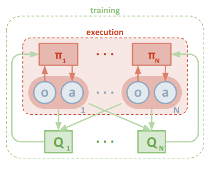
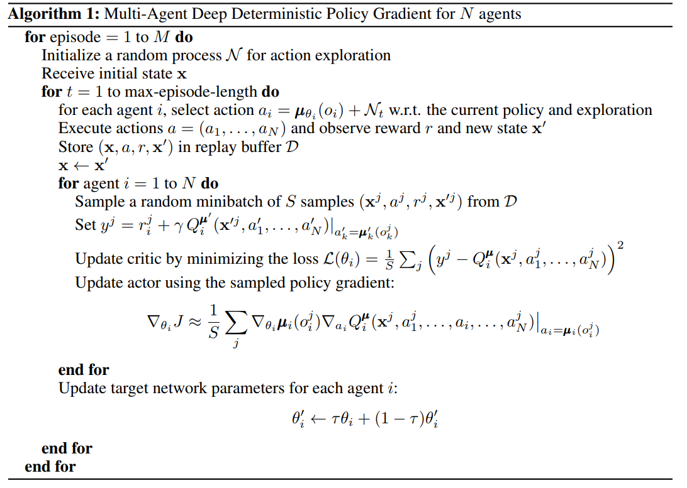
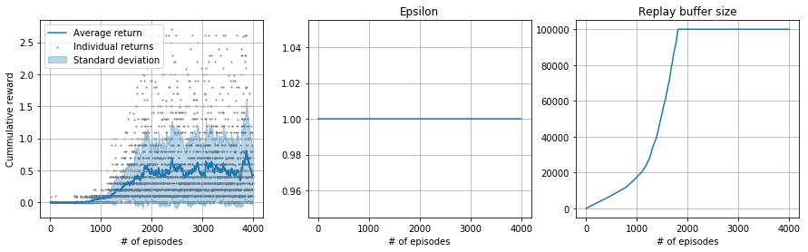

# Collaboration and Competition in a table tennis environment

Iván Vallés Pérez - December 2018

## Introduction
In this project, the Unity [Tennis](https://github.com/Unity-Technologies/ml-agents/blob/master/docs/Learning-Environment-Examples.md#tennis) environment is used in order to train a deep reinforcement learning algorithm in a multi-agent setting.

## Environment dynamics
This is a multiagent environment where two agents take control of a pair of rackets to bounce a ball over a net. If an agent hits the ball over the net, it receives a reward of +0.1.  If an agent lets a ball hit the ground or hits the ball out of bounds, it receives a reward of -0.01.  Thus, the goal of each agent is to keep the ball in play.

The observation space consists of 8 variables corresponding to the position and velocity of the ball and racket. Each agent receives its own, local observation.  Two continuous actions are available, corresponding to movement toward (or away from) the net, and jumping. 

The task is episodic, and in order to solve the environment, the agents must get an average score of +0.5 (over 100 consecutive episodes, after taking the maximum over both agents). Specifically,

- After each episode, we add up the rewards that each agent received (without discounting), to get a score for each agent. This yields 2 (potentially different) scores. We then take the maximum of these 2 scores.
- This yields a single **score** for each episode.

The environment is considered solved, when the average (over 100 episodes) of those **scores** is at least +0.5.

This repository solves this problem, the main implementation can be found in the following jupyter [notebook](notebooks/report_tennis.ipynb).

**Summary**

- **Set-up**: Two-player game where agents control rackets to bounce ball over a net.
- **Goal**: The agents must bounce ball between one another while not dropping or sending ball out of bounds.
- **Agents**: The environment contains two agent linked to a single Brain named TennisBrain. After training you can attach another Brain named MyBrain to one of the agent to play against your trained model.
- **Agent Reward Function (independent)**:
    - **+0.1** To agent when hitting ball over net.
    - **-0.1** To agent who let ball hit their ground, or hit ball out of bounds.
- **Brains**: One Brain with the following observation/action space.
- **Vector Observation space**: 8 variables corresponding to position and velocity of ball and racket.
- **Vector Action space**: (Continuous) Size of 2, corresponding to movement toward net or away from net, and jumping.
- **Visual Observations**: None.
- **Reset Parameters**: One, corresponding to size of ball.
- **Benchmark Mean Reward**: 2.5
- **Optional Imitation Learning scene**: TennisIL.

## Methods
The [**MADDPG**](https://arxiv.org/abs/1706.02275) algorithm has been used as a base algorithm for solving multiagent tasks. It is a simple generalization of the [**DDPG**](https://arxiv.org/pdf/1509.02971.pdf) algorithm to the multiagent setting, consisting of the following modifications:

- The concept of *centralized critic* is introduced, which simply consists of providing the information of the states and actions of all the agents to the critic of each agent. 
- The learned policy uses only local information at execution time (i.e. data coming only from the agent interaction with the environment), which means that there is no communication between agents required. 

The neural networks implemented to solve this environment (both for the critic and for the agent) are simply Multi-Layer Perceptrons with 3 256-units hidden layers.

The neural networks implemented to solve this environment (both for the critic and for the agent) are simply Multi-Layer Perceptrons with 3 256-units hidden layers.

## Getting Started

### Python set-up
The following libraries are required

- numpy
- unityagents
- pytorch
- matplotlib
- pandas

### Environment set-up
1. Download the environment from one of the links below.  You need only select the environment that matches your operating system:
    - Linux: [click here](https://s3-us-west-1.amazonaws.com/udacity-drlnd/P3/Tennis/Tennis_Linux.zip)
    - Mac OSX: [click here](https://s3-us-west-1.amazonaws.com/udacity-drlnd/P3/Tennis/Tennis.app.zip)
    - Windows (32-bit): [click here](https://s3-us-west-1.amazonaws.com/udacity-drlnd/P3/Tennis/Tennis_Windows_x86.zip)
    - Windows (64-bit): [click here](https://s3-us-west-1.amazonaws.com/udacity-drlnd/P3/Tennis/Tennis_Windows_x86_64.zip)
    
    (_For Windows users_) Check out [this link](https://support.microsoft.com/en-us/help/827218/how-to-determine-whether-a-computer-is-running-a-32-bit-version-or-64) if you need help with determining if your computer is running a 32-bit version or 64-bit version of the Windows operating system.

    (_For AWS_) If you'd like to train the agent on AWS (and have not [enabled a virtual screen](https://github.com/Unity-Technologies/ml-agents/blob/master/docs/Training-on-Amazon-Web-Service.md)), then please use [this link](https://s3-us-west-1.amazonaws.com/udacity-drlnd/P3/Tennis/Tennis_Linux_NoVis.zip) to obtain the "headless" version of the environment.  You will **not** be able to watch the agent without enabling a virtual screen, but you will be able to train the agent.  (_To watch the agent, you should follow the instructions to [enable a virtual screen](https://github.com/Unity-Technologies/ml-agents/blob/master/docs/Training-on-Amazon-Web-Service.md), and then download the environment for the **Linux** operating system above._)

2. Place the file in the DRLND GitHub repository, in the `p3_collab-compet/` folder, and unzip (or decompress) the file. 

### Instructions to run the agent
Follow the instructions in `./notebooks/report_tennis.ipynb` to review the training process and, if you wish, reproduce the results. This code will invoke the following modules of the project
- `agent.py`: contains a class for the **MADDPG** and **DDPG** agents to orchestrate all the training process. They will be responsible for collecting samples, interacting with the environment, performing training steps and choosing actions.
- `models.py`: contains the models for the actor and critic which will be the brain of the agent. It is responsible of implementing the technical part of the neural network using pytorch. It will be used by the agent class as an API. 
- `rl_utilities`: contains different functions for helping the agent overcome the necessary tasks (e.g. experience replay).

## Results
The algorithm, with a bit of parameter tunning, has been able to successfully achieve the goal (+0.5 average return over the last 100 episodes). Below, a figure summarizing the training process is shown.

## Conclusions
The **MADDPG** algorithm demonstrated to perform well enough to successfully solve the environment. Both agents have been able to play the game and achieve >0.5 average return over the last 100 episodes. 
- The *tao* parameter has been found to be key for the algorithm to work well. *tao = 0.001* has been tested yielding undesired results, then it has been adjusted to *tao = 0.02*.
- No batch normalization has been used in order to keep the underlying neural networks as simple as possible (to discard potential issues).
- Smaller sizes of the neural nets have been tested, concluding that the current sizes are enough but not too big.

## Next steps
There are several points of improvement and next steps in the current implementation.
- In order to be able to compare these results with other algorithms, the randomness of the agent and environment must be taken into account. For that, several experiments with different random seeds must be run and the average results must be reported.
- In order to try to achieve a more natural movement of the rackets, a penalty for movements is proposed. The biological analogy of it would be the concept of **laziness**. Now, the agent does not have any penalty for doing wiggling or useless movements, penalizing high corrections (high accelerations) can potentially lead to more natural movement. One example of these useless movements could be the movements of the racket of an agent after successfully hitting the ball.
- The current setting motivates the agent to collaborate, but **no competition is promoted**. Giving reward when the contrary misses the ball could lead to interesting aggressive behaviors.
- *Batch Normalization* and *layer normalization* must be tested with the aim of improving the current results.

## Contribution
This repository is fully open to contribution. If you wish to correct a bug, extend the functionality or complete the documentation (or anything else), please, feel free to make a pull request. It will be revised as soon as possible :D. In addition to that, any kind of feedback is welcome.

## License
This repository has been licensed under MIT agreement. For more information check the `LICENSE` file. Copyright (c) 2018 Iván Vallés Pérez
